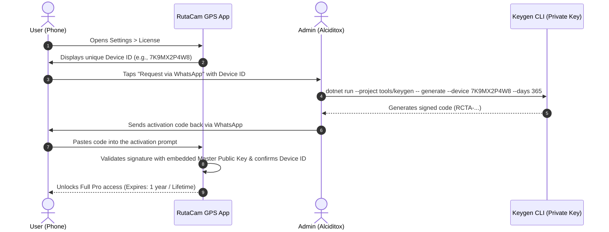

# RutaCam GPS (v3.0.0)

> **High-performance Android dashcam and telemetry video recorder built with .NET 10 MAUI, AndroidX CameraX, and OpenGL ES 2.0.**

[-green.svg)](https://developer.android.com)
[](https://dotnet.microsoft.com)
[](tests/RutaCamGPS.Core.Tests)
[](#)

---

## Overview

**RutaCam GPS** is a professional dashcam application designed for unattended vehicle recording, fleet tracking, and sports telemetry. It embeds live telemetry (speed, altitude, coordinates, timestamps, mini-map, and custom branding) directly onto the recorded MP4 video stream using hardware-accelerated CameraX video capture and custom OpenGL ES shaders.

The application is engineered to operate completely standalone as a sideloaded APK, requiring **no cloud connection, no Google Play Services, and no subscription servers**.

---

## Key Features

- **Hardware-Accelerated Camera Pipeline**:
  - Direct integration with **AndroidX CameraX** (`VideoCapture`, `Recorder`, and `UseCaseGroup`).
  - **GPU Electronic Image Stabilization (EIS V2)** via custom `SurfaceProcessor` using EGL14 and OpenGL ES 2.0 with gyro/accelerometer motion tracking matrices.
  - Live HUD overlay rendered directly onto the video frames at up to 4K resolution (60 FPS on supported hardware).
- **Dual-Source Low-Latency GNSS Speed**:
  - High-frequency NMEA stream parser (`$xxVTG` and `$xxRMC`) yielding sub-second speed response with zero polling lag.
  - Physical vehicle acceleration/deceleration clamping to filter out multi-path GPS glitches (urban canyons, tunnels).
- **Dashcam Loop Recording & Crash Resilience**:
  - Configurable video segment chunking (5, 10, 20, 30 min).
  - FIFO loop storage retention with one-tap emergency clip locking.
  - Active session journal (`active_recording.json`) ensuring automatic recovery and gallery publication after unexpected power loss.
- **Offline Cryptographic Licensing (ECDSA NIST P-256)**:
  - 100% offline activation tied to the hardware `DeviceId`.
  - Master private key held exclusively by the administrator; public key embedded into the core library.
  - Crockford Base32 error-tolerant alphanumeric activation codes (`RCTA-XXXXX-XXXXX-...`).
- **Telemetry Export**:
  - Synchronized GPX tracklogs and high-resolution CSV telemetry records.
  - Direct sharing via Android system sheets and instant WhatsApp support channel integration.

---

## Repository Architecture

The solution is divided into modular, testable layers:

```
RutaCamGPS/
├── src/
│   ├── RutaCamGPS.Core/              # Pure C# business logic (no Android/MAUI dependencies)
│   │   ├── Licensing/                # ECDSA P-256 signing, validation & Crockford Base32 codec
│   │   └── Gps/                      # Geodesic math, physical acceleration bounds & speed filters
│   │
│   └── RutaCamGPS/                   # .NET 10 MAUI Application (net10.0-android)
│       ├── Platforms/Android/        # Native Android foreground services, NMEA GNSS, permissions
│       │   └── Recording/            # CameraX video recorder, EGL/GLES surface processor, audio muxer
│       ├── Services/                 # Activation, storage, crash journal, telemetry services
│       ├── Models/                   # Data transfer objects and settings records
│       └── Resources/                # App icons, splash screens, styles and UI vectors
│
├── tests/
│   └── RutaCamGPS.Core.Tests/        # Automated xUnit test suite (11 unit tests)
│
├── tools/
│   ├── keygen/                       # Administrator CLI license generator & verifier
│   ├── env.ps1                       # Environment bootstrap script
│   ├── setup-toolchain.ps1           # Portable SDK downloader (.NET 10, JDK 17, Android SDK)
│   └── build-apk.ps1                 # Automated Debug & signed Release APK builder
│
└── docs/                             # In-depth architectural & licensing documentation
    ├── ARCHITECTURE.md
    └── LICENSING_GUIDE.md
```

---

## Offline Cryptographic Licensing

Because RutaCam GPS is distributed as an unattended standalone APK without store dependencies, licensing uses **asymmetric cryptography (ECDSA with NIST P-256 curve)**:



### Issuing Licenses (Administrator Quickstart)

1. Initialize master keypair (first-time setup only):
   ```powershell
   . .\tools\env.ps1
   dotnet run --project tools\keygen -- init-keys
   ```
   > ⚠️ **IMPORTANT**: `tools/keygen/master_keys.json` contains your private key and is excluded from git via `.gitignore`. Never share this file!

2. Issue a customer license:
   ```powershell
   # 1-Year license:
   dotnet run --project tools\keygen -- generate --device 7K9MX2P4W8 --days 365

   # Permanent (Lifetime) license:
   dotnet run --project tools\keygen -- generate --device 7K9MX2P4W8 --lifetime

   # 30-Day trial:
   dotnet run --project tools\keygen -- generate --device 7K9MX2P4W8 --days 30
   ```

3. Verify an existing license code:
   ```powershell
   dotnet run --project tools\keygen -- verify --device 7K9MX2P4W8 --code RCTA-XXXXX-XXXXX-...
   ```

---

## Building from Source

### Prerequisites

- Windows 10/11 (or Linux/macOS with .NET 10 SDK)
- .NET 10 SDK with the `maui-android` workload:
  ```powershell
  dotnet workload install maui-android
  ```
- OpenJDK 17
- Android SDK (API 36 platform and build-tools)

*(Optional)* You can install all toolchain dependencies in an isolated, portable directory by running:
```powershell
pwsh -File tools\setup-toolchain.ps1
```

### Compile and Package APK

To generate a signed, distribution-ready APK:

```powershell
# Set up local paths:
. .\tools\env.ps1

# Build Debug APK (fast build for testing):
powershell -ExecutionPolicy Bypass -File tools\build-apk.ps1 -Configuration Debug

# Build Release APK (AOT native compilation, R8 shrinking, signed with keystore):
powershell -ExecutionPolicy Bypass -File tools\build-apk.ps1 -Configuration Release
```

Generated APK packages are automatically exported to the [`dist/`](dist/) folder:
- `dist/RutaCamGPS_3.0.0_Debug.apk` (~21 MB)
- `dist/RutaCamGPS_3.0.0_Release.apk` (~27 MB, Ahead-Of-Time compiled)

---

## Running Automated Tests

Run the test suite across licensing, cryptographic signing, Crockford Base32 encoding, and GPS physical vehicle filters:

```powershell
. .\tools\env.ps1
dotnet test tests\RutaCamGPS.Core.Tests\RutaCamGPS.Core.Tests.csproj
```

**Test Suite Coverage:**
```
✓ Base32Crockford_RoundTrip_PreservesData
✓ Base32Crockford_Normalize_FixesAmbiguousCharacters
✓ LicenseCodec_ValidSignature_VerifiesSuccessfully
✓ LicenseCodec_LifetimeLicense_HasInfiniteExpiry
✓ LicenseCodec_TamperedSignature_IsRejected
✓ LicenseCodec_ExpiredLicense_IsRejected
✓ CalculateDistanceMeters_KnownCoordinates_ReturnsExpectedDistance
✓ CalculateDisplacementSpeedKmh_CalculatesAccurately
✓ CalculateDisplacementSpeedKmh_ZeroTime_ReturnsZero
✓ ApplySpeedResponse_ExcessiveAcceleration_ClampsToPhysicalLimit
✓ ApplySpeedResponse_ExcessiveDeceleration_ClampsToPhysicalLimit
```

---

## Security & Privacy Considerations

- **Private Keys Kept Local**: The administrative private key is stored exclusively on the developer's workstation and never included in compiled APKs or public Git commits.
- **Minimal Android Permissions**: Unnecessary system permissions (such as `android.permission.DUMP`) have been stripped. Legacy Bluetooth permissions are restricted to Android 11 and lower (`maxSdkVersion="30"`), utilizing modern `BLUETOOTH_CONNECT` on Android 12+.
- **Zero Cloud Tracking**: All telemetry, video files, and journals remain strictly on the local device storage (`Movies/RutaCam GPS` and application cache).

---

## Author & Maintainer

- **Developer / Maintainer**: [Alciditox](https://github.com/Alciditox)
- **Repository**: [https://github.com/Alciditox/RutaCamGPS](https://github.com/Alciditox/RutaCamGPS)
